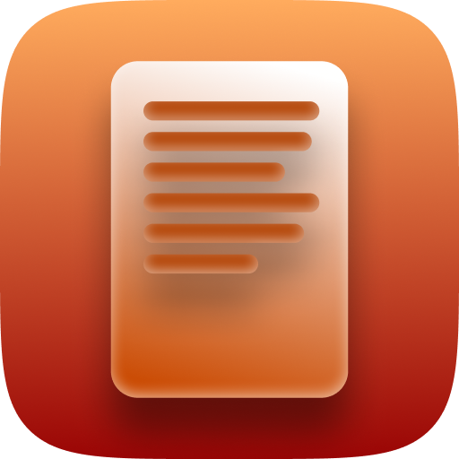

# Esboço app

## Descrição
Escolha a hora programada de termino do discurso, e depois carregue o discurso formatado em um arquivo .md

Ao começar a proferir, tique o Checkbox da primeira seção. Ao entrar na próxima seção, tique o Checkbox correspondente.

Na frente de cada título de seção terá um horário (calculado automaticamente baseado na hora definida de têrmino), indicando em que hora específica você deveria estar começando aquela seção. Acompanhe pelo relógio no canto superior-direito.

Ao ticar cada Checkbox, o tempo restante será calculado para verificar se você está adiantado ou atrasado, e isso será revelado por um código de cores na barra vertical do lado esquerdo dos tópicos.
- Vermelho: Muito atrasado, corra!
- Amarelo: Um pouco atrasado, acelere um pouquinho
- Branco: No tempo
- Verde: Um pouco adiantado
- Rosa: Muito adiantado

## Formatação

Crie o arquivo .MD com a seguinte formatação exata:
- Tema do Discurso: Número seguido de Tema na primeira linha (Ex.: "49 - Será que um dia a Terra vai ser limpa?")
- Seção:
  - @{Título}
  - &{Tempo Total da Seção em Segundos}
- Tópicos:
  - #{Texto Principal de Tópico Nível 1} / ##{MTexto Principal de Tópico Nível 2} / ###{Texto Principal de Tópico Nível 3}
  - ${Texto Escondido}
- Versículos:
  - %{Texto Principal} / ~{Texto Principal para CITAR}
  - ${Texto Escondido}
- Mídia:
  - ^{Texto Principal}
